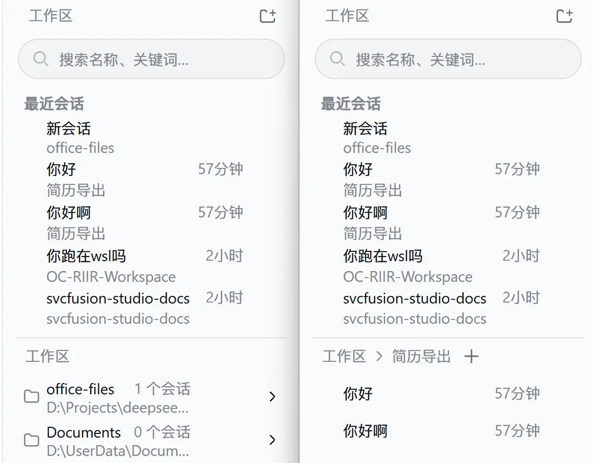

<p align="center">
  <a href="https://dshfind.com/zh/plugins/huanlinoto/dsh-plugin-ya-workspace-sidebar"></a>
</p>

# ya-workspace-sidebar

[](https://www.npmjs.com/package/@huanlin/dsh-plugin-ya-workspace-sidebar)



DSH Web 工作区侧栏替代插件。顶部固定展示 5 条全局最近会话，下方使用 Workspace → Session 二级菜单和面包屑导航；选中工作区的会话按本地日历日期分组（今天/昨天/更早），搜索、添加工作区、重命名、删除、Fork 与归档继续使用 DSH 原生 Host 能力。

## 运行

插件采用 bundle 形式，`cordis.patch.yml` 会禁用官方 `ui-workspace` 并插入 `@huanlin/dsh-plugin-ya-workspace-sidebar`。DSH v0.1.2-alpha.1 起，官方 `ui-sidebar` / `ui-conversation` / `ui-agent-preset` 及目录选择器组合包会注入 `ctx.uiWorkspace` 服务，本插件 client entry 通过 `src/client/navigation.ts` 自供该服务的替身（含复用/新建会话导航、current/recent 回退、归档清理与启动自动选择策略），否则这些条目会永久 pending 导致 WebUI 启动死锁。安装：

```powershell
# 从 npm 安装（推荐）：
dsh plugin --profile web add @huanlin/dsh-plugin-ya-workspace-sidebar

# 本地开发（热更新）：
dsh plugin --profile web add "link:D:/Projects/deepseek-harness/ya-workspace-sidebar"
```

修改源码后重新运行 `pnpm run build`，再重启 `dsh web` 并硬刷新浏览器。

## 开发

```powershell
pnpm install
pnpm run typecheck
pnpm test
pnpm run build
```

`dsh/` 仅作为类型和行为参考，插件不会修改 DSH checkout。浏览器产物预构建到 `lib/client.js`，因此仓库发布时必须提交 `lib/`。

## 检查

```powershell
pnpm run typecheck
pnpm test
pnpm run build
```

构建后确认 `lib/index.js`、`lib/client.js` 和 `lib/types/` 存在，并确认 `lib/client.js` 使用 `window.__ModuleLoader__.load()` 包装。

> 本包自 v0.1.2-rc.1 起不再发布 `./invariant` 导出：本插件贡献的均为 client-only slot 条目，无独立可分歧的观察，按新 invariant 规则省略其源码与接线。
